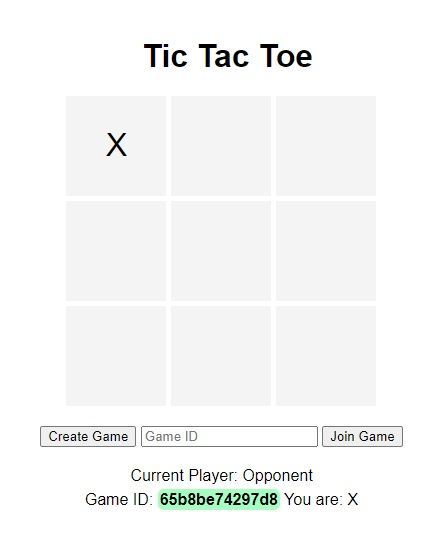

# Tic-Tac-Toe Web Application

A simple web-based Tic-Tac-Toe game that allows 2 players to create, join, and play a game remotely from each other. The application signals when a game has ended and allows for subsequent games to continue.

## Application Screenshot

## Environment Setup

### Requirements

- **PHP**: Supports server-side scripting.
- **Web Browser**: To interact with the game (e.g., Chrome, Firefox, Safari, Edge).

### Installation

1. **XAMPP/WAMP/MAMP**: Install a PHP development environment. This guide assumes you are using XAMPP.
2. **Start Services**: Open the XAMPP Control Panel and start the Apache service.

## File Deployment

1. **Get the Code**: Ensure you have all the project files (`index.html`, `style.css`, `script.js`, `game.php`, `session.php`, `common.php`).
2. **Place in Directory**: Copy the files into the `htdocs` directory of your XAMPP installation.

## Running the Application

1. **Open a Browser**: Launch your preferred web browser.
2. **Access the Game**: Type `localhost/frontend` in the address bar.
3. **Play the Game**: You can create or join a game and interact with the Tic-Tac-Toe board.

## Testing the Application

### Functionality Tests

1. **Game Creation**: Test creating a game and interacting with the board.
2. **Game Joining**: Test joining an existing game using the game ID.
3. **Game Play**: Ensure the game updates across sessions and correctly identifies win conditions and ties.
4. **Game Restart**: After a game ends, the "Restart Game" button should clear the board and allow a new game.

### Error Handling and Edge Cases

1. **Invalid Moves**: The game should not accept moves on filled cells or out of turn.
2. **Simultaneous Sessions**: Multiple games should operate independently.
3. **Server Interruption**: Observe the application's behavior when the server stops unexpectedly.

## Documentation and Support

- **PHP Documentation**: [PHP Official Documentation](https://www.php.net/docs.php)
- **XAMPP Guide**: [Apache Friends](https://www.apachefriends.org/index.html)

